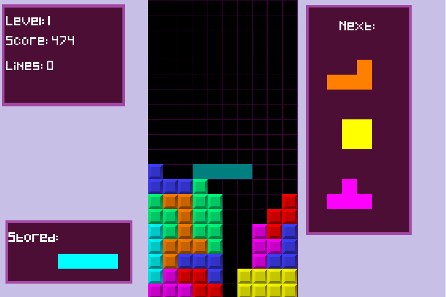
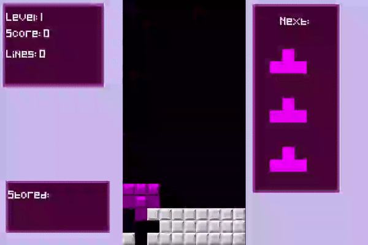

# PyGame Tetris

A Tetris clone written in Python using the PyGame library.

## Install and Run

Install dependencies with ``pip install -r requirements.txt``

Then run ``python main.py``

## Dependencies

- Python 3.12.1
- PyGame 2.5.2

## Controls

- ``Left`` - Move left
- ``Right`` - Move right
- ``Up`` - Rotate clockwise
- ``Down`` - Soft drop
- ``Space`` - Hard drop
- ``Z`` or ``Left Ctrl`` - Rotate counter-clockwise
- ``C`` or ``Left Shift`` - Hold piece

## Testing

For testing of practice moves, run ``python main.py test_name``

Where ``test_name`` is one of the following:

- ``perfect_clear_1`` - tests perfect clears
- ``perfect_clear_2`` - tests perfect clears
- ``combo``   - tests combos
- ``t-spin``  - tests wall kicks using T-Spin

You can add a custom test by modifying the TESTING_SUITE dictionary located in ``data/data_test.py``. The TESTING_GRID value's dimension must coincide with the grid size defined in ``data/config.py``

## Screenshots

